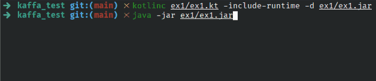

## Exercise 1 - Validate CNPJ format and check digits

Given a string, check if it looks like a CNPJ, considering two formats:

- Formatted: `"00.000.000/0000-00"`
- Number only: `"00000000000000"`

Validate if it's a well-formed CNPJ, considering the "check digits", as defined by Receita Federal.

### Solution

The `CNPJ` class checks whether the string entered by the user is valid or not. To do this, the first step is to validate (using regular expressions) the format of the string:

- Have exactly 14 digits or follow the format `00.000.000/0000-00`;
- Not all 14 digits are the same;

If these validations are valid, the string's two check digits must also be verified. According to the Receita Federal definition, it's necessary to add up each of the digits according to a predefined weight. This sum is modulated by 11 and subtracted from 11 if the sum is greater than 2. Otherwise, the digit is 0.

### Try it yourself

1. Compile: `kotlinc ex1/ex1.kt -include-runtime -d ex1/ex1.jar`;
2. Then run: `java -jar ex1/ex1.jar`.

