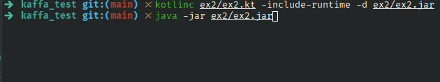

## Exercise 2 - Test if two rectangles intersect

Considering two rectangles in a discrete grid (like pixels in a display), each defined by two points, return `true` if they intersect, `false` otherwise.
**Note:** the points are included in the rectangle and have a dimension of 1 unit; the rectangle `(0, 0; 1, 1)` have an area of 4 units.

### Solution

The `readCoordinates()` function was created, which prompts the user for input, validates the format of the string using regular expressions and, by capturing groups, obtains the four integer values that represent the two points that define an object of the `Rectangle` class.

The `Rectangle` class stores the position of each vertical and horizontal boundary and, from this, it is trivial to check whether two rectangles intersect.

### Try it yourself

1. Compile: `kotlinc ex2/ex2.kt -include-runtime -d ex2/ex2.jar`;
2. Then run: `java -jar ex2/ex2.jar`.

