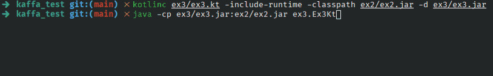

## Exercise 3 - Compute the area of intersection between two rectangles

Considering two rectangles in a discrete grid (like pixels in a display), each defined by two points, compute the area of intersection between the two.
**Note:** the points are included in the rectangle and have a dimension of 1 unit; the rectangle `(0, 0; 1, 1)` have an area of 4 units.

### Solution

In this exercise, the code written for [exercise 2](../ex2) was reused and an [extension](https://kotlinlang.org/docs/extensions.html) of the `Rectangle` class was created by the `intersectionArea()` method.

As seen in this previous exercise, using the position of each boundary of the rectangle it is trivial to calculate the area of two intersecting rectangles.

### Try it yourself

1. Compile: `kotlinc ex3/ex3.kt -include-runtime -classpath ex2/ex2.jar -d ex3/ex3.jar`;
2. Then run: `java -cp ex3/ex3.jar:ex2/ex2.jar ex3.Ex3Kt`.

