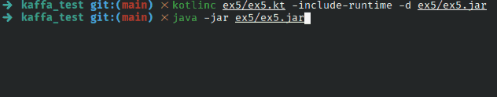

## Exercise 5 - Rest Client - World Clock

Application that queries a server and displays the current date/time hour in local and UTC timezones.
**Server URL:** <http://worldclockapi.com/api/json/utc/now>

### Solution

For this solution, the standard Java language libraries were used, especially `java.net.http`.

An `HttpRequest` object was created, specifying the URl and the GET request method. Thus, by creating another `HttpClient` object, it is possible to send this request and check its status.

If the status is `200 (OK)`, a regular expression is used to extract the value of `“currentDateTime”`. It would be possible to use a JSON parser, but it was decided not to add third-party dependencies to the solution. Thus, the current date and time are obtained as a string, and then converted to UTC and local time.

### Try it yourself

1. Compile: `kotlinc ex5/ex5.kt -include-runtime -d ex5/ex5.jar`;
2. Then run: `java -jar ex5/ex5.jar`.

