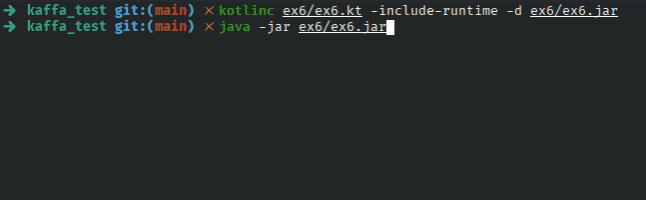

## Exercise 6 - Rest Server - World Clock

REST server returning a JSON like:

```json
{
  "currentDateTime":"2019-08-12T14:40Z"
}
```

### Solution

As in the [previous exercise](../ex5), only standard Java libraries were used, especially `com.sun.net.httpserver`.

The `HttpServer` object was created by defining a hostname (`“localhost”`) and port (`8123`), as well as a context created from a path (`“/now”`) and a handler (`CurrentDateTimeHandler`).

When the server is started, the `handle()` method will be executed every time a request is received and, in response, a string in JSON format containing the current time in UTC is sent.

Again, it was decided not to use a JSON parser in order to avoid using external dependencies.

### Try it yourself

1. Compile: `kotlinc ex6/ex6.kt -include-runtime -d ex6/ex6.jar`;
2. Then run: `java -jar ex6/ex6.jar`.

