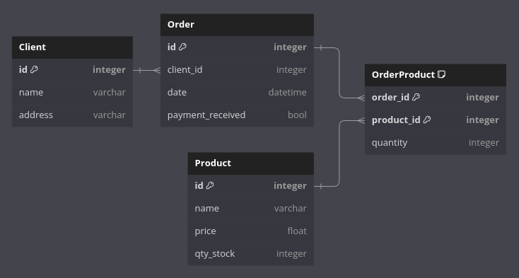

## Exercise 7 - Entity Relationship Diagram - Simple Order Manager

Design the model of a simple Order Manager System. The system consists of:
 
- Clients;
- Products;
- Orders;
- Any other tables you may need.

You can draw, describe, or list the tables as SQL.

Extras:
- SQL: list ORDERS with number of items
- Which indexes should be created in this model?

**Note:** this exercise is documentation only - there's no executable to run in this case.

### Solution

In this model of a simple order manager system, the Client, Order and Product tables were created, with an extra table for the many-to-many relationship of Product and Order.

Each Order is related to just one customer, who can have many Orders. Each Order can have many products listed, and each product can be present in many different orders.



To list all the orders and their respective items, the following SQL command can be used:

```sql
SELECT 
  O.ID, 
  P.name, 
  OP.quantity 
FROM 
  Orders O 
  JOIN OrderProduct OP ON O.id = OP.order_id 
  JOIN Product P ON P.id = OP.product_id 
ORDER BY 
  O.date DESC;
```